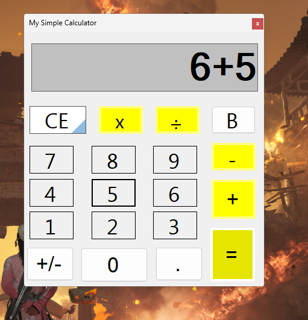
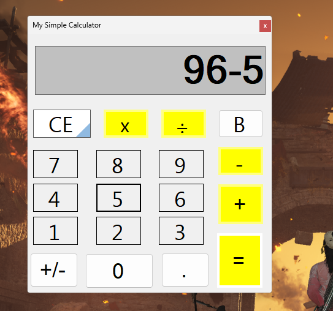
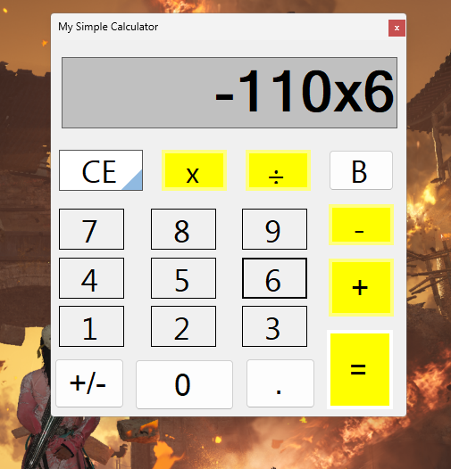
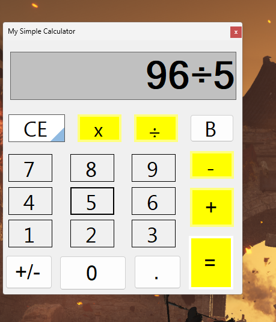

# My Calculator

## 📌 Project Overview

My Calculator is a Windows Forms desktop application that provides basic arithmetic operations.

The system allows users to perform addition, subtraction, multiplication, and division operations easily and efficiently.

This project was built as part of practical training while studying desktop application development.

---

## 🏗 System Architecture

This is a **Single Tier Architecture** application:
1. **Presentation Layer**
   * Windows Forms UI
   * Calculator interface
   * Numeric keypad layout
2. **Application Logic**
   * Arithmetic operations
   * Result calculations
   * Error handling
3. **Data Storage**
   * None (client-side calculation only)
   * Memory-based operation

---

## 🛠 Technologies Used

* C#
* .NET Framework – Windows Forms
* Visual Studio

---

## ✨ System Features

### 🔢 Basic Operations

* Addition (+)
* Subtraction (-)
* Multiplication (×)
* Division (÷)

### 💻 User Interface

* Clear numeric display
* Easy-to-use button layout
* Real-time calculation
* Error handling for invalid operations

---

## 📷 Screenshots

### ➕ Addition Operation



### ➖ Subtraction Operation



### × Multiplication Operation



### ÷ Division Operation



---

## ⚙️ Installation & Setup

1️⃣ Clone the repository

```bash
git clone https://github.com/ss24214859/My-Calculator.git
```

2️⃣ Open the solution file in Visual Studio.

3️⃣ Build and run the project.

4️⃣ Start calculating!

---

## 🚀 Future Enhancements

* Scientific functions (sin, cos, tan, etc.)
* Memory functions (M+, M-, MC, MR)
* History of calculations
* Keyboard support
* Custom themes
* Calculator presets

---

## 👨‍💻 Author

**Mohamed Shaaban**

* GitHub: [https://github.com/ss24214859](https://github.com/ss24214859)

---

## 📜 License

This project is for learning purposes and training.
